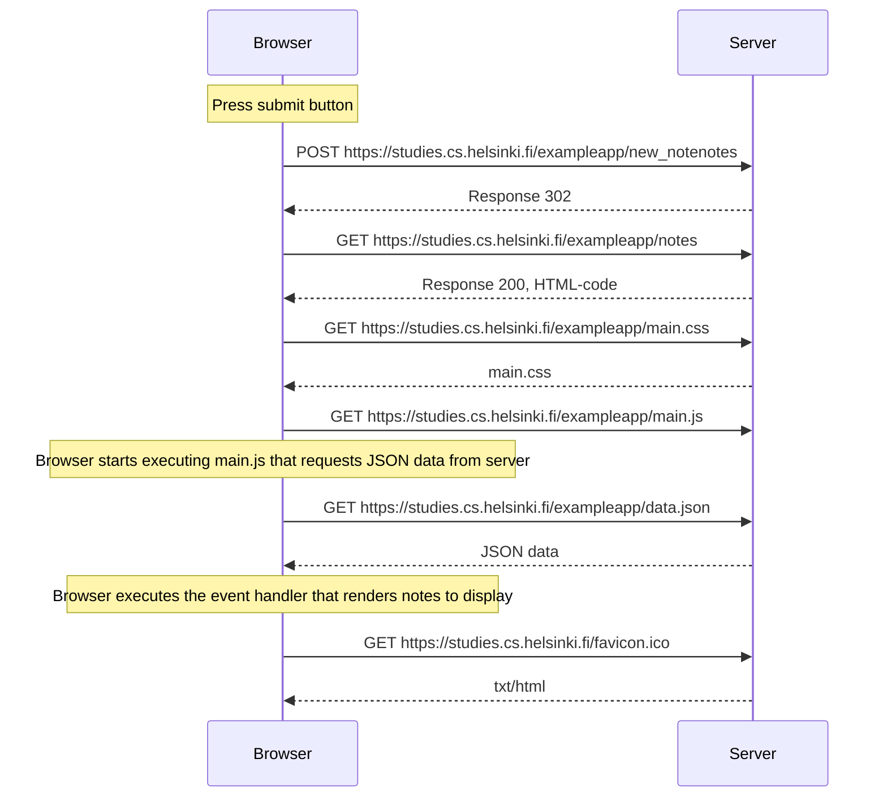

## 0.4: New note

>Sequence diagram: Submit new node in   
https://studies.cs.helsinki.fi/exampleapp/notes

```mermaid
sequenceDiagram
Note over Browser: Press submit button
Browser->>Server: POST https://studies.cs.helsinki.fi/exampleapp/new_notenotes
Server-->>Browser: Response 302
Browser->>Server: GET https://studies.cs.helsinki.fi/exampleapp/notes
Server-->>Browser: Response 200, HTML-code
Browser->>Server: GET https://studies.cs.helsinki.fi/exampleapp/main.css
Server-->>Browser: main.css
Browser->>Server: GET https://studies.cs.helsinki.fi/exampleapp/main.js
Note over Browser: Browser starts executing main.js that requests JSON data from server
Browser->>Server: GET https://studies.cs.helsinki.fi/exampleapp/data.json
Server-->>Browser: JSON data
Note over Browser: Browser executes the event handler that renders notes to display
Browser->>Server: GET https://studies.cs.helsinki.fi/favicon.ico
Server-->>Browser: txt/html
```